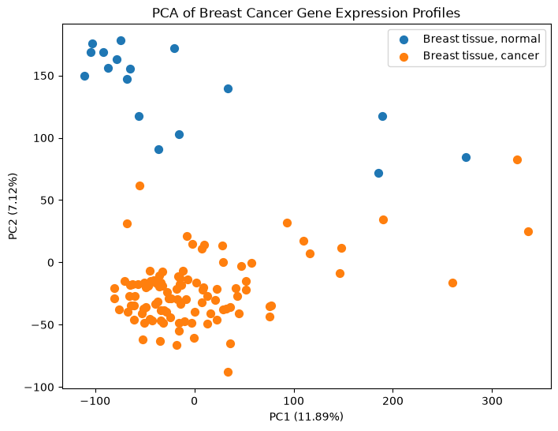
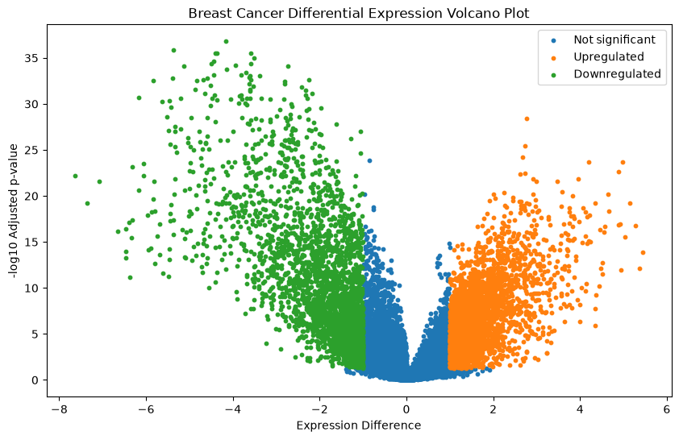
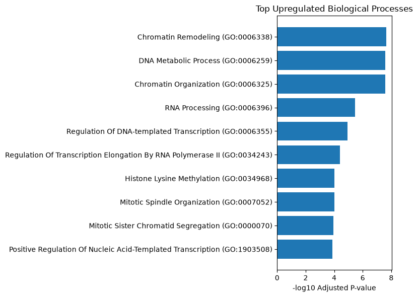
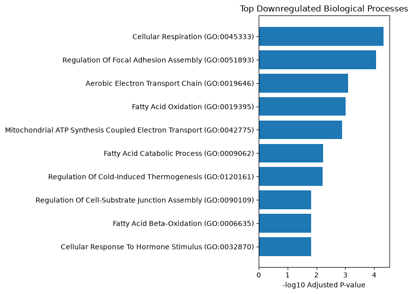

# Breast Cancer Biomarker Discovery Using Transcriptomic Analysis

<p align="center">
  
</p>

<p align="center">
  <a href="notebooks/Breast_Cancer_Biomarker_Discovery.ipynb">
    
  </a>
  
  
</p>

---

# Overview

This project investigates gene expression differences between breast cancer and normal breast tissue using publicly available transcriptomic data from the Gene Expression Omnibus (GEO) database.

The objective of this analysis is to identify differentially expressed genes, characterize molecular changes associated with breast cancer, and explore biological pathways involved in disease progression.

The workflow integrates statistical differential expression analysis, gene annotation, dimensional reduction, clustering, and functional enrichment analysis to identify potential biomarker candidates.

---

# Dataset

**Dataset:** GSE42568  
**Platform:** Affymetrix Human Genome U133 Plus 2.0 Array (GPL570)  
**Organism:** Homo sapiens  

The dataset contains:

- 104 breast cancer tissue samples
- 17 normal breast tissue samples

Gene expression profiles and sample metadata were obtained from the GEO database.

---

# Analysis Workflow

## 1. Data Acquisition

- Downloaded GEO expression data using GEOparse.
- Extracted expression profiles and sample metadata.
- Constructed the gene expression matrix for downstream analysis.

---

## 2. Data Processing

The dataset was processed by:

- Separating breast cancer and normal tissue samples.
- Organizing expression values by probe IDs.
- Mapping Affymetrix probe IDs to gene annotations using GPL570 annotation data.

---

## 3. Differential Expression Analysis

Gene expression differences between cancer and normal tissue were evaluated using statistical testing.

Multiple hypothesis testing correction was performed using False Discovery Rate (FDR) adjustment.

A total of:

**6,468 significant genes**

were identified after statistical correction.

---

# Key Results

## Differentially Expressed Genes

The analysis identified both:

- Upregulated genes
- Downregulated genes

between breast cancer and normal breast tissue.

The strongest expression changes included genes associated with:

- Cellular regulation
- Chromatin organization
- DNA metabolism
- Mitochondrial processes
- Lipid metabolism

---

# Visualization Results

## Principal Component Analysis (PCA)

PCA was performed to evaluate global gene expression patterns and sample separation between breast cancer and normal tissue.

<p align="center">
  
</p>

---

## Differential Expression Volcano Plot

The volcano plot highlights genes showing significant expression differences between breast cancer and normal tissue.

<p align="center">
  
</p>

---

## Heatmap of Differentially Expressed Genes

Hierarchical clustering was performed on selected significant genes to visualize expression patterns across samples.

The heatmap demonstrates distinct gene expression profiles between breast cancer and normal breast tissue samples.

<p align="center">
  
</p>

---

# Functional Enrichment Analysis

Gene Ontology (GO) enrichment analysis was performed separately for upregulated and downregulated genes using gseapy.

---

## Upregulated Gene Enrichment

Major enriched biological processes included:

- Chromatin remodeling
- Chromatin organization
- DNA metabolic processes
- RNA processing
- Regulation of transcription

These findings indicate alterations in gene regulation and cellular control mechanisms in breast cancer tissue.

---

<p align="center">
  
</p>

---

## Downregulated Gene Enrichment

Downregulated genes were associated with:

- Cellular respiration
- Electron transport chain
- Fatty acid oxidation
- Mitochondrial ATP synthesis
- Lipid metabolic processes

Several metabolic genes showed reduced expression, including:

- FABP4
- LEP
- RBP4
- LPL
- CD36
- PLIN1
- PCK1

---

<p align="center">
  
</p>

---

# Technologies Used

## Programming Language

- Python

## Data Analysis

- pandas
- numpy
- scipy
- statsmodels
- scikit-learn

## Bioinformatics Tools

- GEOparse
- GSEAPY

## Visualization

- matplotlib
- seaborn

---

# Project Structure


Breast-Cancer-Biomarker-Discovery/

├── assets/
│ └── project_preview.png
│
├── data/
│
├── notebooks/
│ └── Breast_Cancer_Biomarker_Discovery.ipynb
│
├── results/
│ ├── PCA_plot.png
│ ├── volcano_plot.png
│ ├── GO_upregulated.png
│ ├── GO_downregulated.png
│ └── heatmap.png
│
├── requirements.txt
│
├── README.md
│
└── .gitignore


---

# Reproducibility

Clone the repository:

```bash
git clone https://github.com/Rashi-88/breast-cancer-biomarker-discovery.git

Install dependencies:

pip install -r requirements.txt

Run the analysis notebook:

jupyter notebook notebooks/Breast_Cancer_Biomarker_Discovery.ipynb
Future Improvements

Potential extensions of this project include:

Validation of candidate biomarkers using independent GEO datasets
Survival analysis using clinical annotations
Machine learning-based classification models
Integration of additional omics datasets
Protein interaction and pathway network analysis
Author
Rashi Malghe

Bioinformatics | Biotechnology | Data Science