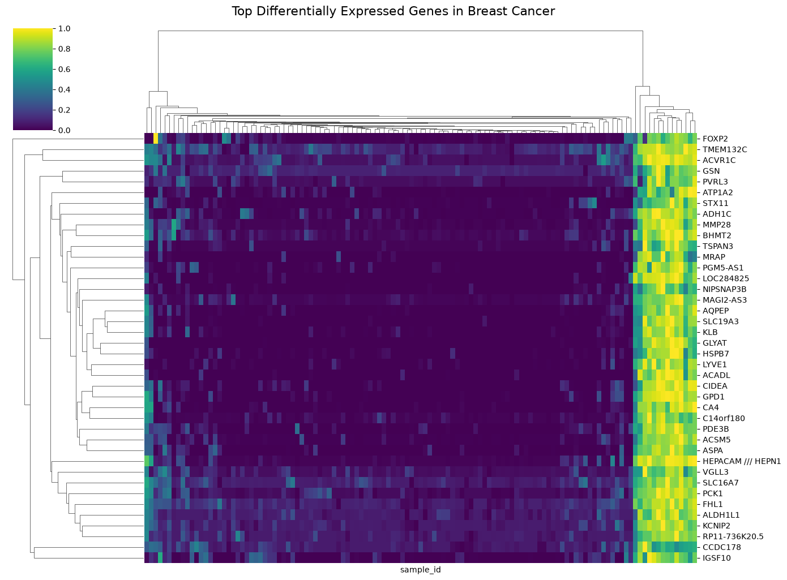

# Breast Cancer Biomarker Discovery Using Transcriptomic Analysis

<p align="center">
  
</p>

<p align="center">
  <a href="notebooks/Breast_Cancer_Biomarker_Discovery.ipynb">
    
  </a>
  
  
</p>

---

## Overview

This project investigates gene expression differences between breast cancer and normal breast tissue using publicly available transcriptomic data from the Gene Expression Omnibus (GEO) database.

The objective of this analysis is to identify differentially expressed genes, characterize molecular changes associated with breast cancer, and explore biological pathways that may contribute to disease progression.

The workflow integrates statistical differential expression analysis, gene annotation, dimensionality reduction, clustering, and functional enrichment analysis to identify potential biomarker candidates.

---

# Dataset

**Dataset:** GSE42568  
**Platform:** Affymetrix Human Genome U133 Plus 2.0 Array (GPL570)  
**Organism:** Homo sapiens  

The dataset consists of:

- 104 breast cancer tissue samples
- 17 normal breast tissue samples

Gene expression profiles and sample metadata were obtained from the GEO database.

---

# Analysis Workflow

## 1. Data Acquisition

- Downloaded GEO expression data using GEOparse.
- Extracted sample metadata and expression measurements.
- Constructed the gene expression matrix for downstream analysis.

---

## 2. Data Processing

The dataset was processed by:

- Separating cancer and normal tissue samples.
- Organizing expression values by probe IDs.
- Mapping Affymetrix probe identifiers to gene annotations.

---

## 3. Differential Expression Analysis

Gene expression differences between cancer and normal tissue were evaluated using statistical testing.

Multiple hypothesis testing correction was performed using False Discovery Rate (FDR) adjustment.

Significant genes were defined using:

- Adjusted p-value threshold
- Expression difference between groups

---

# Key Results

## Differentially Expressed Genes

A total of:

**6,468 significant genes**

were identified between breast cancer and normal breast tissue after statistical correction.

Both upregulated and downregulated expression patterns were observed.

---

# Visualization Results

## Principal Component Analysis (PCA)

PCA was performed to evaluate overall expression patterns and sample separation between cancer and normal breast tissue.

---

## Differential Expression Volcano Plot

The volcano plot highlights genes showing statistically significant expression changes between the two conditions.

---

## Heatmap of Differentially Expressed Genes

Hierarchical clustering was performed on selected significant genes to visualize expression patterns across samples.

The heatmap demonstrates clear differences in gene expression profiles between breast cancer and normal tissue samples.

<p align="center">
  
</p>

---

# Functional Enrichment Analysis

Gene Ontology (GO) enrichment analysis was performed separately for upregulated and downregulated genes.

## Upregulated Biological Processes

The major enriched processes included:

- Chromatin remodeling
- Chromatin organization
- DNA metabolic processes
- RNA processing
- Regulation of transcription

These findings suggest alterations in gene regulation and cellular control mechanisms in breast cancer tissue.

---

## Downregulated Biological Processes

Downregulated genes were enriched in:

- Cellular respiration
- Electron transport chain
- Fatty acid oxidation
- Mitochondrial ATP synthesis
- Lipid metabolic processes

Several metabolic genes showed reduced expression, including:

- FABP4
- LEP
- RBP4
- LPL
- CD36
- PLIN1
- PCK1

These results indicate disruption of normal metabolic programs in breast cancer tissue.

---

# Technologies Used

## Programming

- Python

## Data Analysis

- pandas
- numpy
- scipy
- statsmodels
- scikit-learn

## Bioinformatics

- GEOparse
- GSEAPY

## Visualization

- matplotlib
- seaborn

---

# Project Structure
# Reproducibility

Clone the repository:

```bash
git clone https://github.com/Rashi-88/breast-cancer-biomarker-discovery.git

Install dependencies:

pip install -r requirements.txt

Run the analysis notebook:

jupyter notebook notebooks/Breast_Cancer_Biomarker_Discovery.ipynb